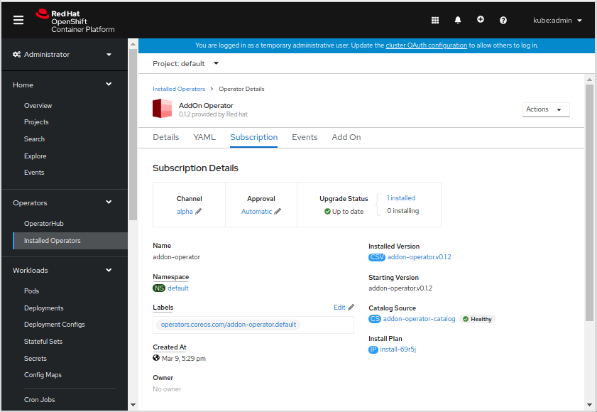

# AddOn Operator

**This is a mockup. No real functionality is implemented so far.**




## Installing


```
apiVersion: addon.example.com/v1alpha1
kind: AddOn
metadata:
  name: prow-operator
spec:
  targetNamespace: prow-operator
  catalogSourceImage: quay.io/osd-addons/prow-operator-index:71ac363
  operatorGroupInstallMode: SingleNamespace
  subscriptionChannel: alpha
  parameters:
    key1: value1
    key2: value2
    key3: value3
  monitoringStack: true
  upgradeSchedule: 0 10 * * 1-5
  openShiftVesions:
  - 4.6.11
  delete: false
```

Logs:

```
INFO controllers.AddOn Checking cluster compatibility {"addon": "prow-operator"}
INFO controllers.AddOn Monitoring Stack already deployed {"addon": "prow-operator"}
INFO controllers.AddOn Creating the Namespace {"addon": "prow-operator"}
INFO controllers.AddOn Creating the CatalogSource {"addon": "prow-operator"}
INFO controllers.AddOn Creating the OperatorGroup {"addon": "prow-operator"}
INFO controllers.AddOn Creating the Subscription {"addon": "prow-operator"}
INFO controllers.AddOn Creating the Params ConfigMap {"addon": "prow-operator"}
INFO controllers.AddOn Creating the PD and DMS Secret {"addon": "prow-operator"}
```

## Updating

```diff
apiVersion: addon.example.com/v1alpha1
kind: AddOn
metadata:
  name: prow-operator
spec:
  targetNamespace: prow-operator
- catalogSourceImage: quay.io/osd-addons/prow-operator-index:71ac363
+ catalogSourceImage: quay.io/osd-addons/prow-operator-index:ae6c761
  operatorGroupInstallMode: SingleNamespace
  subscriptionChannel: alpha
  parameters:
    key1: value1
    key2: value2
    key3: value3
  monitoringStack: true
  upgradeSchedule: 0 10 * * 1-5
  openShiftVesions:
  - 4.6.11
  delete: false
```

Logs:

```
INFO controllers.AddOn Checking cluster compatibility {"addon": "prow-operator"}
INFO controllers.AddOn Updating CatalogSource {"addon": "prow-operator"}
INFO controllers.AddOn OLM upgrade pending approval. Waiting until the next maintenance slot {"addon": "prow-operator"}
...
INFO controllers.AddOn Approving pending upgrade {"addon": "prow-operator"}
```

## Deleting

```diff
apiVersion: addon.example.com/v1alpha1
kind: AddOn
metadata:
  name: prow-operator
spec:
  targetNamespace: prow-operator
  catalogSourceImage: quay.io/osd-addons/prow-operator-index:ae6c761
  operatorGroupInstallMode: SingleNamespace
  subscriptionChannel: alpha
  parameters:
    key1: value1
    key2: value2
    key3: value3
  monitoringStack: true
  upgradeSchedule: 0 10 * * 1-5
  openShiftVesions:
  - 4.6.11
- delete: false
+ delete: true
```

Logs:

```
INFO controllers.AddOn Deleting the Subscription {"addon": "prow-operator"}
INFO controllers.AddOn Deleting the CatalogSource {"addon": "prow-operator"}
INFO controllers.AddOn Deleting the OperatorGroup {"addon": "prow-operator"}
INFO controllers.AddOn Deleting the PD and DMS Secret {"addon": "prow-operator"}
INFO controllers.AddOn Deleting the Params ConfigMap {"addon": "prow-operator"}
INFO controllers.AddOn Deleting the Namespace {"addon": "prow-operator"}
```
